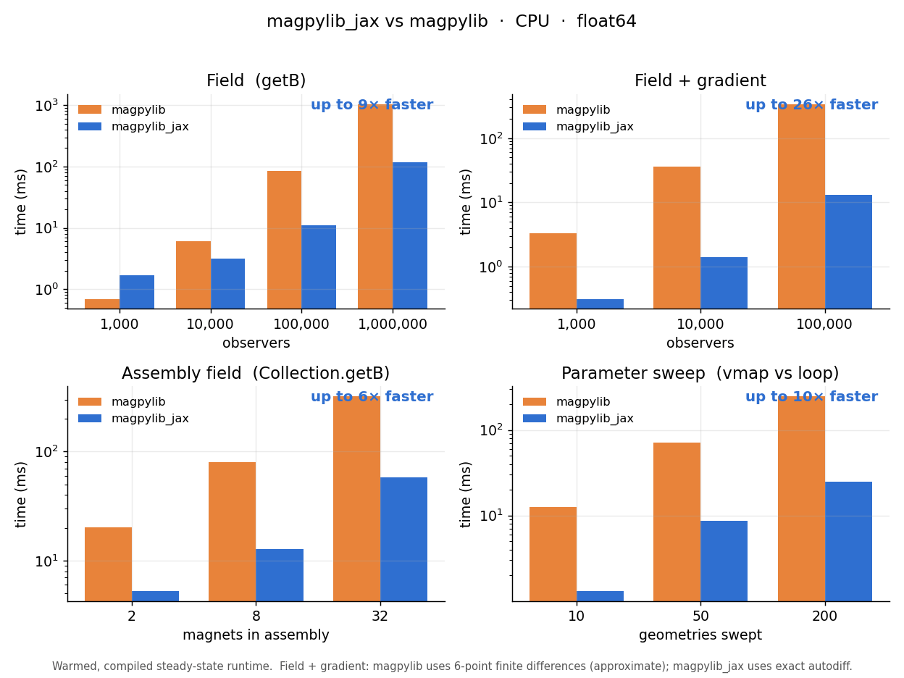
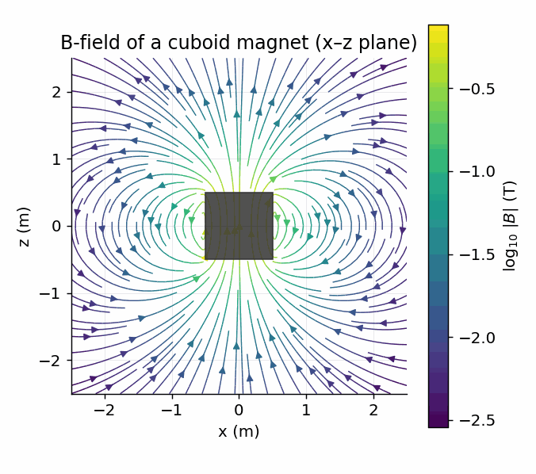
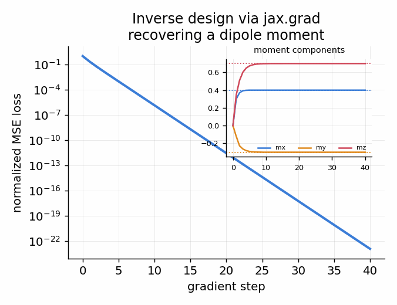
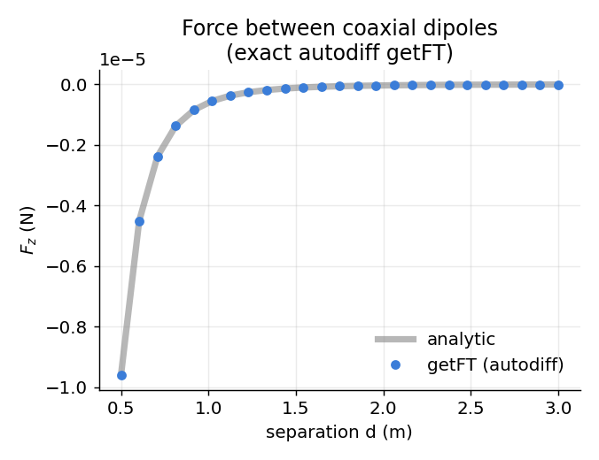
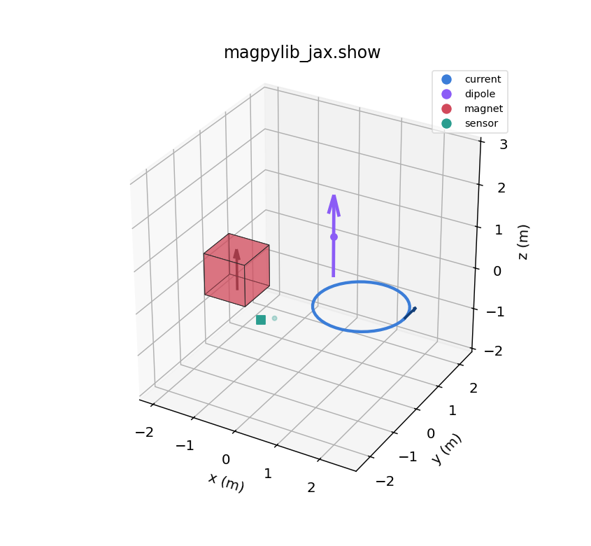

# magpylib_jax

[](https://github.com/uwplasma/magpylib_jax/actions/workflows/ci.yml)
[](https://github.com/uwplasma/magpylib_jax/actions/workflows/ci.yml)
[](https://pypi.org/project/magpylib-jax/)
[](https://pypi.org/project/magpylib-jax/)
[](https://magpylib-jax.readthedocs.io/)
[](LICENSE)

**Analytic magnetic fields that you can differentiate, compile, and optimize through.**

`magpylib_jax` is a clean-room, [JAX](https://github.com/jax-ml/jax)-native reimplementation of
[Magpylib](https://github.com/magpylib/magpylib). It keeps Magpylib's ergonomic object and
functional APIs and its analytic field models, but replaces the numerical core with a
differentiable, JIT-compilable, `vmap`-friendly implementation — so the same field computation
you use for analysis can sit inside a `jax.grad` optimization loop.

## Performance at a glance

<p align="center">
  
</p>

Same analytic physics as Magpylib, several times faster on the workloads that matter — **and
differentiable, which Magpylib is not.** Warmed, compiled, steady-state runtime on **CPU**
(float64); the gap widens further on GPU/TPU.

- **Batched fields** — one `Cuboid` over a million observers: **~9× faster** `getB`, the lead
  growing with batch size as XLA fuses the kernel.
- **Field + gradient** — a field-derived loss *and* its gradient w.r.t. source parameters:
  Magpylib has no autodiff, so it must finite-difference (6 extra evaluations, only approximate);
  magpylib_jax returns the **exact** gradient in one pass — **up to ~25× faster** and machine-precise.
- **Magnet assemblies** — `Collection.getB` over a 32-magnet array: **~6× faster**.
- **Parameter sweeps** — 200 geometries mapped with `vmap` instead of a Python loop: **~10× faster**.

Numbers vary with machine and problem size — tiny problems favour Magpylib's low-overhead NumPy,
and the crossover is visible in the leftmost bars. Reproduce them with
`python scripts/make_benchmark_plots.py`. The deeper win is that the *same* call is differentiable,
`jit`/`vmap`-able, and runs on GPU/TPU:

```python
import jax, magpylib_jax as mpj
# exact dB_z / d(height), no finite differences:
jax.grad(lambda h: mpj.magnet.Cuboid(polarization=(0, 0, 1.0),
         dimension=(1.0, 1.0, h)).getB((2.0, 0, 0))[2])(1.0)
```

## Why magpylib_jax?

Magpylib gives you fast closed-form fields but no derivatives. Finite-differencing it through an
optimizer is slow and noisy. `magpylib_jax` closes that gap:

- **End-to-end differentiable** — `jax.grad`, `jacfwd`, `jacrev` through `getB/getH/getJ/getM`
  and through geometry, pose, and excitation. Exact gradients, no finite differences.
- **Compiled & vectorized** — the field core runs under `jax.jit`/`vmap`/XLA on CPU/GPU/TPU.
- **Exact force & torque** — `getFT` computes magnetic force and torque by autodiff (`∇(m·B)`),
  so — unlike Magpylib's finite-difference `getFT` — the magnet result is independent of a step
  size `eps` and exact to machine precision.
- **Magpylib-compatible** — same source classes, `Collection`, `Sensor`, path/orientation motion,
  squeeze/`pixel_agg` semantics, and SI units, validated against upstream in CI.
- **Lean & readable** — the numerical core is split into small, well-named modules
  (`core/kernels/`, `fields/`) with one obvious way to compute each field.

<p align="center">
  
</p>

## Differences from Magpylib

magpylib_jax reproduces Magpylib's full numerical feature set — and adds gradients, compilation,
accelerators, and exact force/torque on top.

| Feature | magpylib_jax | Magpylib |
|---|:---:|:---:|
| All 12 source families (magnets · currents · misc) | ✅ | ✅ |
| `getB` / `getH` / `getJ` / `getM` | ✅ | ✅ |
| `Collection` · `Sensor` · motion & paths | ✅ | ✅ |
| `sumup` / `squeeze` / `pixel_agg` / `output="dataframe"` | ✅ | ✅ |
| Functional (`func`) & low-level (`core`) interfaces | ✅ | ✅ |
| Force & torque — `getFT` | ✅ &nbsp;autodiff, exact | ✅ &nbsp;finite differences |
| 3-D `show()` | ✅ &nbsp;matplotlib | ✅ &nbsp;matplotlib · plotly · pyvista |
| Drop-in API (`import magpylib_jax as magpy`) | ✅ | — |
| **Gradients** — `grad` / `jacfwd` / `jacrev` | ✅ | ❌ |
| **`jit` / `vmap` compilation & vectorization** | ✅ | ❌ |
| **GPU / TPU execution** | ✅ | ❌ |
| Selectable `float32` / `float64` precision | ✅ | ❌ &nbsp;float64 only |
| Interactive plotly / pyvista display · style system | ❌ | ✅ |

Everything Magpylib computes, magpylib_jax computes too (validated against upstream in CI); the only
things left aside are the interactive plotly/pyvista display backends and the full graphical style
system. See the [parity strategy](docs/parity.md).

### Drop-in for magpylib

Most magpylib field-computation scripts run unchanged — just swap the import:

```python
# import magpylib as magpy
import magpylib_jax as magpy   # same source classes, Collection, Sensor,
                               # getB/getH/getJ/getM, getFT, show, and mu_0
```

The source classes, `Collection`, `Sensor`, motion (`move`/`rotate*`), `getB/getH/getJ/getM`,
`getFT`, `show`, `mu_0`, the `func` (high-level) and `core` (low-level) field interfaces, and
`SUPPORTED_PLOTTING_BACKENDS` all match. Fields come back as JAX arrays (use `np.asarray(...)` if a
downstream call needs NumPy). Only the interactive plotly/pyvista `show` backends and the full
graphical style system (`defaults`/`graphics`) are left aside. A compatibility test suite
(`tests/test_magpylib_compat.py`) exercises the shared API.

## Installation

```bash
pip install magpylib-jax
```

For GPU/TPU, install the matching `jax`/`jaxlib` build first, then `magpylib-jax`.
Development install:

```bash
pip install -e '.[test,docs]'
pytest
```

## Choosing precision (float32 vs float64)

magpylib_jax follows **your** JAX precision setting and never changes the global JAX config on
import — so *you* pick the precision, exactly like any other JAX code. The one rule: set it
**before** you build any array.

**float64** — full magpylib parity and the tightest gradients (recommended for scientific work):

```python
import jax
jax.config.update("jax_enable_x64", True)   # <-- do this first, before importing magpylib_jax
import magpylib_jax as mpj

mpj.magnet.Cuboid(polarization=(0, 0, 1.0), dimension=(1, 1, 1)).getB((2, 0, 0)).dtype
# -> float64
```

**float32** — JAX's default; faster and lower-memory, ideal on GPU/TPU and for ML pipelines. Just
don't enable x64:

```python
import magpylib_jax as mpj   # no x64 -> float32

mpj.magnet.Cuboid(polarization=(0, 0, 1.0), dimension=(1, 1, 1)).getB((2, 0, 0)).dtype
# -> float32
```

| | float32 (default) | float64 (`jax_enable_x64=True`) |
|---|---|---|
| speed / memory | faster, lighter (esp. GPU/TPU) | slower, 2× memory |
| magpylib parity | ~1e-6 relative | bit-level (~1e-15) |
| how to select | do nothing | `jax.config.update("jax_enable_x64", True)` before use |

The test suite runs with x64 enabled (via `conftest.py`).

## Quickstart

```python
import jax
jax.config.update("jax_enable_x64", True)     # float64, for parity with magpylib
import jax.numpy as jnp
import magpylib_jax as mpj

# Object API — identical feel to magpylib
src = mpj.magnet.Cuboid(polarization=(0, 0, 1.0), dimension=(1.0, 1.0, 1.0))
B = src.getB([(2.0, 0.0, 0.0), (0.0, 0.0, 2.0)])   # tesla, shape (2, 3)

# Differentiate the field w.r.t. any parameter
def bz(height):
    return mpj.magnet.Cuboid(polarization=(0, 0, 1.0),
                             dimension=(1.0, 1.0, height)).getB((2.0, 0, 0))[2]
print(jax.grad(bz)(1.0))                            # dB_z / d(height)
```

## Inverse design in a few lines

Because the field is differentiable, fitting geometry or excitation to a target is just gradient
descent — no finite differences, no wrappers:

```python
import jax, jax.numpy as jnp
import magpylib_jax as mpj

obs = jnp.array([[0.2, 0.1, 0.4], [0.5, 0.0, 0.7]])
target = jnp.array([[2.0e-4, 0.0, 3.0e-4], [1.0e-4, 0.0, 2.0e-4]])

def loss(pol):
    pred = mpj.magnet.Cuboid(dimension=(1.0, 0.8, 1.2), polarization=pol).getB(obs)
    return jnp.mean((pred - target) ** 2)

grad = jax.jit(jax.grad(loss))
pol = jnp.array([0.05, -0.02, 0.08])
for _ in range(100):
    pol = pol - 1e-1 * grad(pol)
```

<p align="center">
  
</p>

The loss above falls to machine precision in a few dozen exact-gradient steps — recovering a dipole
moment with no finite differences and no hand-written derivatives.

## Force & torque by autodiff — `getFT`

```python
import magpylib_jax as mpj
from magpylib_jax import getFT

magnet = mpj.magnet.Cuboid(polarization=(0, 0, 1.0), dimension=(1., 1., 1.))
loop   = mpj.current.Circle(diameter=2.0, current=1e3, position=(0, 0, 1.0), meshing=50)
F, T = getFT(magnet, loop)          # force (N) and torque (N·m)
```

Force on a magnet is `F = ∇(m·B)` obtained with `jax.jacfwd`, and current force is `(I dL)×B`.
The magnet result carries no finite-difference step, so it is exact and `eps`-independent —
and `getFT` is itself differentiable.

<p align="center">
  
</p>

## Performance — reading the numbers

The [four-panel comparison above](#performance-at-a-glance) is the headline; a few notes on how to
reproduce those numbers and get them yourself:

- **Warmed, compiled, steady-state.** JAX is asynchronous and compiles on the first call, so the
  figure warms up once (not timed) and wraps every result in `jax.block_until_ready(...)`, measuring
  compute rather than dispatch. **`jax.jit` your field function and reuse it** — the first call to a
  new array shape pays a one-time compile that amortizes across an optimization loop.
- **Where each side wins.** After compilation magpylib_jax's XLA kernels are competitive on CPU and
  pull ahead as work is batched (observers, assembly size, sweep width); Magpylib's low-overhead
  NumPy still wins the *smallest* problems, which the leftmost bars show honestly.
- **Exact vs approximate gradients.** Magpylib has no autodiff, so the *field + gradient* panel pits
  its 6-point finite differences (approximate, step-size dependent) against magpylib_jax's single
  exact reverse pass — the largest and most decisive gap.
- **`getFT` too.** Force/torque is jittable and differentiable when geometry and `meshing` are
  static (only excitation/pose are traced), so `jax.jit(jax.grad(loss))` over a `getFT`-based loss
  compiles once.

> The panels report the active backend in their titles, so re-running
> `python scripts/make_benchmark_plots.py` on a GPU/TPU host regenerates the figure with that
> device's numbers — where the batched, fused kernels parallelize much further. See the
> [performance guide](docs/performance.md) for the full methodology.

## Visualize with `show()`

```python
import magpylib_jax as mpj

scene = mpj.Collection(
    mpj.magnet.Cuboid(polarization=(0, 0, 1.0), dimension=(1, 1, 1)),
    mpj.current.Circle(diameter=2.0, current=100.0, position=(1.5, 0, -1)),
    mpj.misc.Dipole(moment=(0, 0, 1.0), position=(1.5, 0, 1)),
    mpj.Sensor(position=(0, 0, -1.2), pixel=[[0, 0, 0]]),
)
scene.show()   # or mpj.show(obj_a, obj_b, ...)
```

<p align="center">
  
</p>

Magnets render as shaded bodies with a polarization arrow, currents as loops/lines with a
direction arrow, dipoles as moment arrows, and sensors as markers with their pixel grid and local
axes; paths draw as faint trails. Pass an existing `ax` to compose with your own figure, or
`return_fig=True` for headless use.

## Supported sources

`magnet.Cuboid`, `magnet.Cylinder`, `magnet.CylinderSegment`, `magnet.Sphere`,
`magnet.Tetrahedron`, `magnet.TriangularMesh`, `current.Circle`, `current.Polyline`,
`current.TriangleSheet`, `current.TriangleStrip`, `misc.Dipole`, `misc.Triangle`,
`misc.CustomSource` — plus `Collection` and `Sensor`.

## Documentation

- [Overview](docs/overview.md) · [Quickstart](docs/quickstart.md)
- [Equation models & derivations](docs/equations.md) · [Numerics & differentiability](docs/numerics.md)
- [Examples](docs/examples/index.md): object API, functional API, force & torque, visualization, optimization, performance
- [Architecture & source map](docs/architecture.md) · [Testing & validation](docs/testing.md)
- [Performance](docs/performance.md) · [Parity strategy](docs/parity.md) · [API reference](docs/reference/api.md)
- [Changelog](https://github.com/uwplasma/magpylib_jax/releases)

## Citing

If `magpylib_jax` supports your research, please cite this repository and the upstream Magpylib
papers it builds on (see [docs/equations.md](docs/equations.md) for the model references).

## License

BSD-2-Clause. Built by the [UW-Madison plasma group](https://github.com/uwplasma) as a
differentiable companion to Magpylib.
