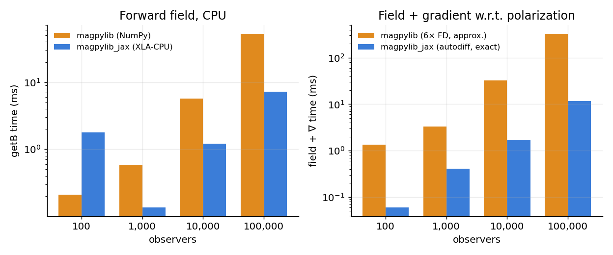

# magpylib_jax

[](https://github.com/uwplasma/magpylib_jax/actions/workflows/ci.yml)
[](https://github.com/uwplasma/magpylib_jax/actions/workflows/ci.yml)
[](https://pypi.org/project/magpylib-jax/)
[](https://pypi.org/project/magpylib-jax/)
[](https://magpylib-jax.readthedocs.io/)
[](LICENSE)

**Analytic magnetic fields that you can differentiate, compile, and optimize through.**

`magpylib_jax` is a clean-room, [JAX](https://github.com/jax-ml/jax)-native reimplementation of
[Magpylib](https://github.com/magpylib/magpylib). It keeps Magpylib's ergonomic object and
functional APIs and its analytic field models, but replaces the numerical core with a
differentiable, JIT-compilable, `vmap`-friendly implementation — so the same field computation
you use for analysis can sit inside a `jax.grad` optimization loop.

<p align="center">
  
  
</p>

## Why magpylib_jax?

Magpylib gives you fast closed-form fields but no derivatives. Finite-differencing it through an
optimizer is slow and noisy. `magpylib_jax` closes that gap:

- **End-to-end differentiable** — `jax.grad`, `jacfwd`, `jacrev` through `getB/getH/getJ/getM`
  and through geometry, pose, and excitation. Exact gradients, no finite differences.
- **Compiled & vectorized** — the field core runs under `jax.jit`/`vmap`/XLA on CPU/GPU/TPU.
- **Exact force & torque** — `getFT` computes magnetic force and torque by autodiff (`∇(m·B)`),
  so — unlike Magpylib's finite-difference `getFT` — the magnet result is independent of a step
  size `eps` and exact to machine precision.
- **Magpylib-compatible** — same source classes, `Collection`, `Sensor`, path/orientation motion,
  squeeze/`pixel_agg` semantics, and SI units, validated against upstream in CI.
- **Lean & readable** — the numerical core is split into small, well-named modules
  (`core/kernels/`, `fields/`) with one obvious way to compute each field.

## Differences from Magpylib

| | Magpylib 5.x | magpylib_jax |
|---|---|---|
| Backend | NumPy | JAX (CPU/GPU/TPU, XLA) |
| Gradients | ✗ (finite-diff by hand) | ✓ `grad`/`jacfwd`/`jacrev`, exact |
| `jit` / `vmap` | ✗ | ✓ field core |
| `getFT` force/torque | finite differences (step `eps`) | autodiff, exact, `eps`-free |
| Precision | float64 | float64 (x64 enabled on import) |
| 3-D `show()` display | ✓ (matplotlib/plotly/pyvista) | ✓ (matplotlib) |
| Source families | all | all 12 (parity-tested) |

magpylib_jax matches magpylib's numerical surface and adds exact gradients and `getFT`. It ships a
matplotlib `show()` (below); the extra plotly/pyvista backends and the full interactive style
system are the only display features left aside. See the [parity strategy](docs/parity.md).

### Drop-in for magpylib

Most magpylib field-computation scripts run unchanged — just swap the import:

```python
# import magpylib as magpy
import magpylib_jax as magpy   # same source classes, Collection, Sensor,
                               # getB/getH/getJ/getM, getFT, show, and mu_0
```

The source classes, `Collection`, `Sensor`, motion (`move`/`rotate*`), `getB/getH/getJ/getM`,
`getFT`, `show`, `mu_0`, and `SUPPORTED_PLOTTING_BACKENDS` all match. Fields come back as JAX arrays
(use `np.asarray(...)` if a downstream call needs NumPy). Not shimmed: the plotly/pyvista `show`
backends, the full `defaults`/`graphics` style trees, and the `magpy.func`/`magpy.core` low-level
interfaces. A compatibility test suite (`tests/test_magpylib_compat.py`) exercises the shared API.

## Installation

```bash
pip install magpylib-jax
```

For GPU/TPU, install the matching `jax`/`jaxlib` build first, then `magpylib-jax`.
Development install:

```bash
pip install -e '.[test,docs]'
pytest
```

## Quickstart

```python
import jax, jax.numpy as jnp
import magpylib_jax as mpj                     # enables float64 on import

# Object API — identical feel to magpylib
src = mpj.magnet.Cuboid(polarization=(0, 0, 1.0), dimension=(1.0, 1.0, 1.0))
B = src.getB([(2.0, 0.0, 0.0), (0.0, 0.0, 2.0)])   # tesla, shape (2, 3)

# Differentiate the field w.r.t. any parameter
def bz(height):
    return mpj.magnet.Cuboid(polarization=(0, 0, 1.0),
                             dimension=(1.0, 1.0, height)).getB((2.0, 0, 0))[2]
print(jax.grad(bz)(1.0))                            # dB_z / d(height)
```

## Inverse design in a few lines

Because the field is differentiable, fitting geometry or excitation to a target is just gradient
descent — no finite differences, no wrappers:

```python
import jax, jax.numpy as jnp
import magpylib_jax as mpj

obs = jnp.array([[0.2, 0.1, 0.4], [0.5, 0.0, 0.7]])
target = jnp.array([[2.0e-4, 0.0, 3.0e-4], [1.0e-4, 0.0, 2.0e-4]])

def loss(pol):
    pred = mpj.magnet.Cuboid(dimension=(1.0, 0.8, 1.2), polarization=pol).getB(obs)
    return jnp.mean((pred - target) ** 2)

grad = jax.jit(jax.grad(loss))
pol = jnp.array([0.05, -0.02, 0.08])
for _ in range(100):
    pol = pol - 1e-1 * grad(pol)
```

The plot on the right above shows the loss for recovering a dipole moment this way.

## Force & torque by autodiff — `getFT`

```python
import magpylib_jax as mpj
from magpylib_jax import getFT

magnet = mpj.magnet.Cuboid(polarization=(0, 0, 1.0), dimension=(1., 1., 1.))
loop   = mpj.current.Circle(diameter=2.0, current=1e3, position=(0, 0, 1.0), meshing=50)
F, T = getFT(magnet, loop)          # force (N) and torque (N·m)
```

Force on a magnet is `F = ∇(m·B)` obtained with `jax.jacfwd`, and current force is `(I dL)×B`.
The magnet result carries no finite-difference step, so it is exact and `eps`-independent —
and `getFT` is itself differentiable.

<p align="center">
  
  
</p>

## Performance

The benchmark above is measured on **CPU**, with the field wrapped in `jax.jit` and compilation
paid once (the intended usage inside an optimization loop):

- **Forward field (left):** once jitted, magpylib_jax's XLA kernel is competitive with — and here
  several times faster than — Magpylib's NumPy core on large observer batches. On GPU/TPU the same
  kernel parallelizes further.
- **Field + gradient (right):** Magpylib has no autodiff, so a gradient of a field-derived quantity
  w.r.t. source parameters needs finite differences — 6 extra forward evaluations for a 3-component
  polarization, and only approximate. magpylib_jax returns the **exact** gradient from one reverse
  pass (`value_and_grad`), roughly an order of magnitude faster here and machine-precise.

Two caveats worth knowing: **`jax.jit` your field function and reuse it** (the eager object API
pays per-call dispatch overhead that dominates small problems), and for timing wrap results in
`jax.block_until_ready(...)` so you measure compute, not async dispatch. This applies to `getFT`
too — it is jittable and differentiable when the geometry and `meshing` are static (only the
excitation/pose are traced), so `jax.jit(jax.grad(loss))` over a `getFT`-based loss compiles once.

> The benchmark is CPU. The panel titles report the active backend, so re-running
> `python scripts/make_figures.py` on a GPU/TPU host regenerates the figure with that device's
> numbers, where the batched, fused kernels parallelize much further.

## Visualize with `show()`

```python
import magpylib_jax as mpj

scene = mpj.Collection(
    mpj.magnet.Cuboid(polarization=(0, 0, 1.0), dimension=(1, 1, 1)),
    mpj.current.Circle(diameter=2.0, current=100.0, position=(1.5, 0, -1)),
    mpj.misc.Dipole(moment=(0, 0, 1.0), position=(1.5, 0, 1)),
    mpj.Sensor(position=(0, 0, -1.2), pixel=[[0, 0, 0]]),
)
scene.show()   # or mpj.show(obj_a, obj_b, ...)
```

<p align="center">
  
</p>

Magnets render as shaded bodies with a polarization arrow, currents as loops/lines with a
direction arrow, dipoles as moment arrows, and sensors as markers with their pixel grid and local
axes; paths draw as faint trails. Pass an existing `ax` to compose with your own figure, or
`return_fig=True` for headless use.

## Supported sources

`magnet.Cuboid`, `magnet.Cylinder`, `magnet.CylinderSegment`, `magnet.Sphere`,
`magnet.Tetrahedron`, `magnet.TriangularMesh`, `current.Circle`, `current.Polyline`,
`current.TriangleSheet`, `current.TriangleStrip`, `misc.Dipole`, `misc.Triangle`,
`misc.CustomSource` — plus `Collection` and `Sensor`.

## Documentation

- [Overview](docs/overview.md) · [Quickstart](docs/quickstart.md)
- [Equation models & derivations](docs/equations.md) · [Numerics & differentiability](docs/numerics.md)
- [Examples](docs/examples/index.md): object API, functional API, force & torque, visualization, optimization, performance
- [Architecture & source map](docs/architecture.md) · [Testing & validation](docs/testing.md)
- [Performance](docs/performance.md) · [Parity strategy](docs/parity.md) · [API reference](docs/reference/api.md)
- [Refactor & roadmap plan](PLAN.md) · [Changelog](CHANGELOG.md)

## Citing

If `magpylib_jax` supports your research, please cite this repository and the upstream Magpylib
papers it builds on (see [docs/equations.md](docs/equations.md) for the model references).

## License

BSD-2-Clause. Built by the [UW-Madison plasma group](https://github.com/uwplasma) as a
differentiable companion to Magpylib.
